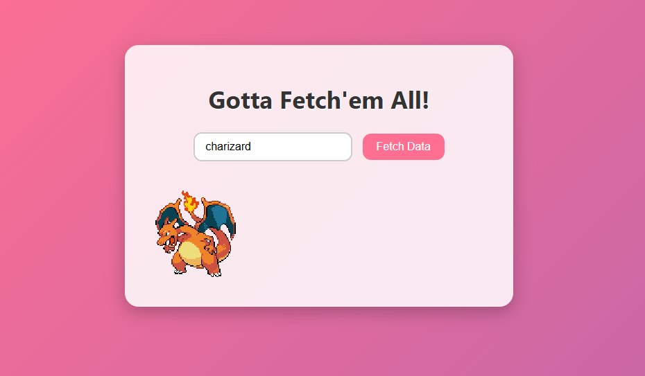

# Pokémon Fetch App

A simple JavaScript project that fetches Pokémon data from the [PokéAPI](https://pokeapi.co/) and displays the sprite of the selected Pokémon.

---

## 🚀 Features
- Search any Pokémon by name.
- Fetches data from the PokéAPI.
- Displays the Pokémon's front sprite image.
- Minimal and clean interface.

---

## 🖼️ Demo Screenshot



---


## 🛠️ How It Works
1. Type the name of a Pokémon in the input field.
2. Click **Fetch Data**.
3. The Pokémon’s sprite image will appear below.

---

## 📜 Code Example
The main JavaScript fetch logic:
```javascript
async function fetchData() {
  try {
    const pokemonName = document.getElementById("pokemonName").value.toLowerCase();
    const response = await fetch(`https://pokeapi.co/api/v2/pokemon/${pokemonName}`);
    if (!response.ok) {
      throw new Error(`HTTP error! status: ${response.status}`);
    }
    const data = await response.json();
    const pokemonSprite = data.sprites.front_default;
    const imgElement = document.getElementById("pokemonSprite");

    imgElement.src = pokemonSprite;
    imgElement.style.display = 'block';
  } catch (error) {
    console.error("Error fetching data:", error);
  }
}
